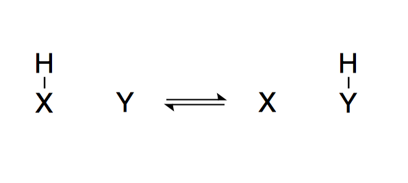
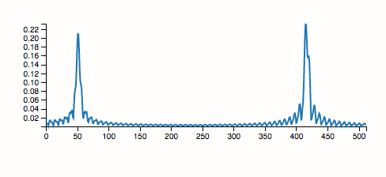
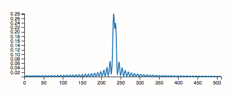

# Frequency coalescence


Simulates the coalescence of peaks in an ensemble of variable-frequency oscillators, often encountered with exchanging protons in NMR experiments (also an exercise in using JavaScript generators for signal generation/processing).
The <sup>1</sup>H signal emitted by the above system depends on which one of X or Y the H is bonded to. With slow exchange (f<sub>exchange</sub> ≪ | f<sub>X-H</sub> – f<sub>Y-H</sub> |), two distinct peaks result:



Fast exchange (f<sub>exchange</sub> ≫ | f<sub>X-H</sub> – f<sub>Y-H</sub> |) gives a single peak at the average of f<sub>X-H</sub> and f<sub>Y-H</sub>:



# Modifying the simulation

```bash
npm install
npm run dev # or npm run build
```

Then go to `http://localhost:8000`.
## TODO
- Display the (phase-adjusted) real part of the FFT instead of its magnitude.
- Package `fft-asm.js` as npm package, then pull it in as a proper dependency.

## Credits
- [g200kg/Fft-asm.js](https://github.com/g200kg/Fft-asm.js) for FFT calculation
